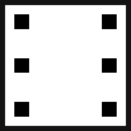

#  Dice Game 

Implementacja gry w kości (Yahtzee) w stylu retro, zbudowana przy użyciu **C# 12**, **SadConsole 10** oraz **MonoGame**.

## Szybki start

1. Upewnij się, że masz zainstalowane **.NET 8 SDK**.
2. Otwórz terminal w **głównym folderze repozytorium**.
3. Uruchom aplikację:
   ```bash
   dotnet run --project DiceGame
   ```
4. Uruchom testy jednostkowe:
   ```bash
   dotnet test
   ```

## Główne cechy techniczne

- **Architektura warstwowa**: Wyraźne oddzielenie logiki gry (`Logic/`) od warstwy prezentacji (`Components/`).
- **Zarządzanie pamięcią**: Implementacja interfejsu `IDisposable` w komponentach UI w celu eliminacji wycieków pamięci przy subskrypcji zdarzeń.
- **Logika punktacji**: Pełne pokrycie testami jednostkowymi klasy `ScoreCalculator` (40 przypadków testowych, w tym dane z Wikipedii).
- **Deduplikacja UI**: Wydzielenie wspólnej logiki renderowania oraz systemu motywów do klasy `BasePanel`.
- **Orkiestracja**: Stabilne zarządzanie ekranami oparte na zdarzeniach i zapewnienie poprawnego zamykania aplikacji.

## Decyzje projektowe

### Architektura warstwowa i testowalność

Zasady gry i obliczenia punktowe zostały umieszczone w przestrzeni `Logic/`, która nie posiada żadnych zależności od silnika graficznego (zależności od silnika znajdują się wyłącznie w folderach `Components/` oraz `Scenes/`). Pozwala to na błyskawiczne uruchamianie testów jednostkowych bez potrzeby inicjalizacji okna gry.

Mimo że projekty gier często opierają się na testach manualnych, tutaj zdecydowano się na pokrycie testami logiki punktacji. Ponieważ mechanika gry opiera się na obliczeniach matematycznych, testy jednostkowe są najlepszym sposobem na zagwarantowanie bezbłędnej implementacji wszystkich zasad (w tym weryfikację skomplikowanych układów takich jak strity czy full).

### Wspólna klasa bazowa UI

Wszystkie panele interfejsu dziedziczą po abstrakcyjnej klasie `BasePanel`, która dostarcza współdzielone metody renderowania (ramki, centrowanie tekstu) oraz jednolity system motywów. Eliminuje to duplikację kodu wizualnego i zapewnia spójny wygląd całego interfejsu.

### Cykl życia UI

Komunikacja między stanem gry a interfejsem odbywa się poprzez zdarzenia (events). Aby zapobiec wyciekom pamięci, komponenty UI implementują `IDisposable`, co zapewnia poprawne odpinanie handlerów zdarzeń przy przejściu między ekranami.

### Centralizacja konfiguracji

Wszystkie kluczowe parametry, takie jak wymiary interfejsu, progi punktowe czy wartości premii, zostały zgrupowane w klasach statycznych (`GameSettings.cs`, `ScoreCategory.cs`). Zapewnia to jedno źródło prawdy (SSOT) dla całego projektu.

## Struktura projektu

- **DiceGame.sln** – Główne rozwiązanie.
- **DiceGame/** – Projekt aplikacji:
  - **Logic/** – Logika biznesowa, zasady i modele.
  - **Components/** – System motywów i komponenty UI.
  - **Scenes/** – Ekrany aplikacji (Menu, Gra).
  - **Assets/** – Czcionki, dźwięki i grafika.
- **DiceGame.Tests/** – Testy jednostkowe (xUnit).

## Zasady gry

1. **Cel gry**: Zdobądź jak najwięcej punktów, wypełniając 13 kategorii na tablicy wyników.
2. **Tura**: Masz do dyspozycji maksymalnie **3 rzuty**. Po każdym rzucie możesz "zamrozić" wybrane kości klikając na nie.
3. **Zapisywanie punktów**: Po zakończeniu rzutów wybierz kategorię w tabeli, aby przypisać do niej punkty. Każda kategoria może być użyta tylko raz.
4. **Premia**: Jeśli suma punktów w górnej sekcji (1-6) wyniesie co najmniej **63**, otrzymasz dodatkowe **35 punktów**.
5. **Koniec gry**: Gra kończy się w momencie, gdy wszyscy gracze zapełnią wszystkie 13 kategorii w tabeli wyników. Zwycięża osoba z najwyższą sumą punktów.

### Szczegółowa punktacja

#### Górna tabela wyników

| Kategoria   | Wynik                    |
| :---------- | :----------------------- |
| **Jedynki** | Suma wyrzuconych jedynek |
| **Dwójki**  | Suma wyrzuconych dwójek  |
| **Trójki**  | Suma wyrzuconych trójek  |
| **Czwórki** | Suma wyrzuconych czwórek |
| **Piątki**  | Suma wyrzuconych piątek  |
| **Szóstki** | Suma wyrzuconych szóstek |

#### Dolna tabela wyników

| Kategoria       | Warunek                    | Wynik      |
| :-------------- | :------------------------- | :--------- |
| **3 jednakowe** | 3 jednakowe kości          | Suma kości |
| **4 jednakowe** | 4 jednakowe kości          | Suma kości |
| **Full**        | Trójka i para              | 25 pkt     |
| **Mały strit**  | 4 kości z oczkami po kolei | 30 pkt     |
| **Duży strit**  | 5 kości z oczkami po kolei | 40 pkt     |
| **Król**        | 5 jednakowych kości        | 50 pkt     |
| **Szansa**      | Dowolne kości              | Suma kości |

## Zasoby i podziękowania

### Muzyka

"Bit Shift" Kevin MacLeod ([incompetech.com](https://incompetech.com/music/royalty-free/index.html?isrc=USUAN1600045&Search=Search))  
Licensed under Creative Commons: By Attribution 4.0 License  
http://creativecommons.org/licenses/by/4.0/

### Efekty dźwiękowe

Dźwięki retro wygenerowano przy użyciu narzędzia **[Bfxr](https://www.bfxr.net/)**.

### Czcionka

**Cheepicus 12x12**: Standardowa czcionka silnika SadConsole.
